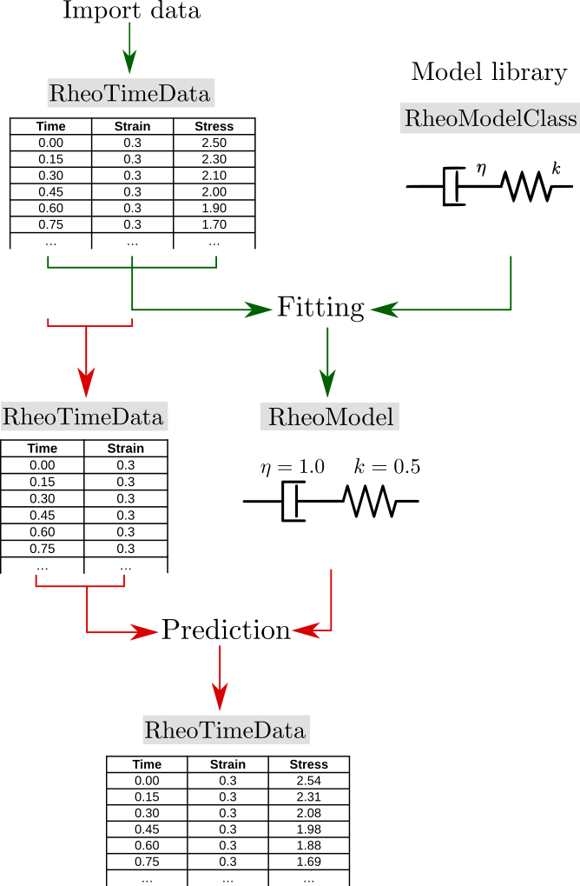

# Architecture

RHEOS is build around four main data types:
+ RheoTimeData: it contains time (t), stress (σ), strain (ϵ) data;
+ RheoFreqData: it contains frequency (ω), storage (Gp) and loss (Gpp) moduli;
+ RheoModelClass: it contains the model's name, parameters, relaxation (G), creep (J), storage (Gp) and loss (Gpp) moduli functions and a skematic graphical representation of the model;
+ RheoModel: it contains the functions for relaxation, creep, storage and loss moduli in which the parameters have been substituted with values;

A common RHEOS workflow is illustrated in the figure below. Experimental time-domain viscoelastic data is fitted to a viscoelastic model. This model (with the fitted parameters) is then used to make a prediction of the behaviour under the fitted loading conditions so that its accuracy can be qualitatively assessed. Similarly, the fitted model can be used to simulate the behaviour of the same material under any loading conditions (different from the fitted ones).

This section will briefly discuss how these three types fit in to standard rheology data processing pipelines.

Experimental data are imported into a RheoTimeData strut (or RheoFreqData for dynamic experimental data). This is then fitted to a RheoModelClass, which is the model struct used when the model's parameters are not fixed.
The output of this process is a RheoModel (which is a RheoModelClass in which the parameters have been fixed to specific values). In the prediction step, the fitted RheoModel is combined with partial data (RheoTimeData with time and either only stress or strain) and fills in the missing data column, resulting in a complete data set (complete RheoTimeData).
