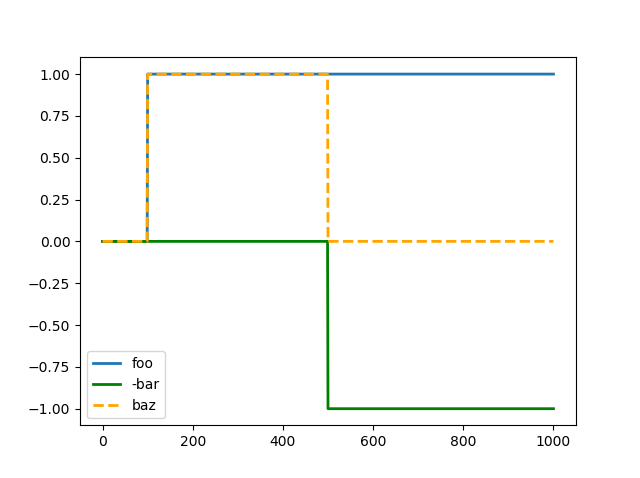
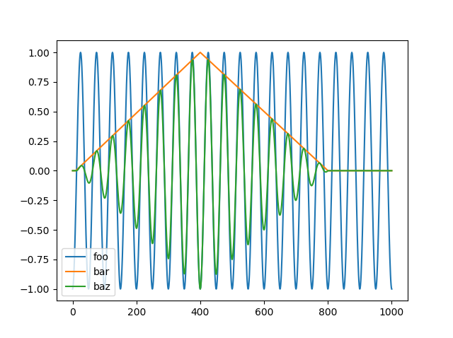
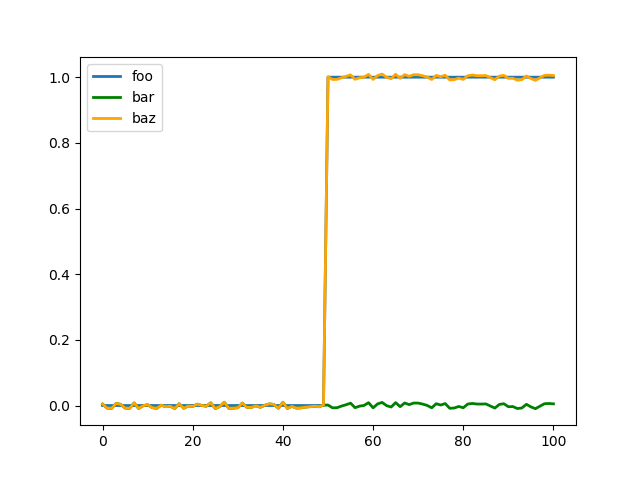
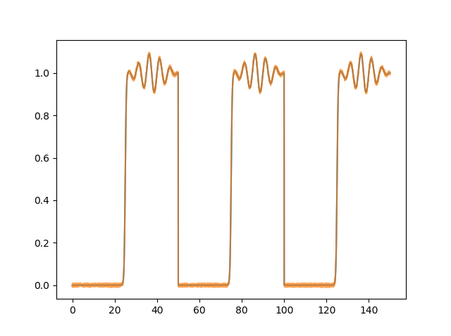
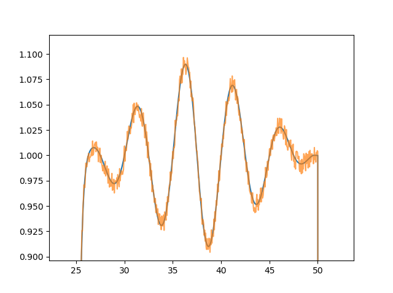

# Generating Data

RHEOS has several convenience functions for generating arbitrarily complex loading patterns. These may be particularly useful for investigating the responses of viscoelastic models with which users are unfamiliar. This section will demonstrate how to use them. 

It should be noted at the outset that the way these functions are currently implemented, they generate the same loading in both stress and strain with the expectation that users will then use one or other to make predictions. 

As all the structs generated are of [`RheologyData`](@ref) type, the same addition, subtraction and multiplication overloaded methods can be used for real data. When adding two [`RheologyData`](@ref) structs and one is longer than the other (in time), the shorter one will be extended by keeping the last values of that shorter struct's data constant for the rest of time. Adding, subtracting and multiplying will raise an error if the data do not have the same sample rate. All plots here are generated using the [PyPlot Julia package](https://github.com/JuliaPy/PyPlot.jl).

## Step, Ramp and Oscillatory Loading
The code below uses [`stepgen`](@ref) to create one step starting at 100 seconds (with total duration of 1000 seconds) and another step starting at 500 seconds lasting the same total duration. The first argument of [`stepgen`](@ref) determines the total length in seconds. The second step is then subtracted from the first to create a new combined loading pattern as shown in the plots below. 
```
foo = stepgen(1000, 100)

bar = stepgen(1000, 500)

baz = foo - bar
```


The above example uses an 'instantaneous' step. However, a logistic functional transition can be used by adding a non-zero `t_trans` keyword argument. Next we'll generate ramp loading using [`rampgen`](@ref). The arguments in order are the total time length (as before), the time to start the ramp and the time to stop the ramp.
```
foo = rampgen(1000, 100, 200)

bar = rampgen(1000, 500, 700)

baz = 2*foo - bar
```


And finally some oscillatory loading, ramp loading, and oscillatory loading multiplied by the ramp loading. The first argument of [`singen`](@ref) is the total time length, the second is the frequency in hertz, and the keyword argument is phase in radians.
```
foo = singen(1000, 1/50; phase = -π/2)

bar = rampgen(1000, 10, 400) - rampgen(1000, 400, 800)

baz = foo*bar
```


## Repeated Loading, Adding Noise
For repeated loading, RHEOS provides a convenience function that can loop loading patterns a specified number of times. Similar to the step function, [`repeatdata`](@ref) also offers a `t_trans` keyword argument which determines the transition between the end of one loop and the start of the next. If `t_trans=0` then the transition is instantaneous, if not the transition occurs by logistic function with approximate transition time `t_trans`. The [`repeatdata`](@ref) function currently only works if the stress and strain arrays contain the same data (as is produced by all the data generation functions). Below we use our most recently defined `baz` variable (the oscillatory loading multiplied by the two ramps) to demonstrate.
```
repeatedbaz = repeatdata(baz, 3)
```


Finally, we can add uniform white noise to the data using the [`noisegen`](@ref) function. The below example demonstrates this on a simple step.
```
foo = stepgen(100, 50)
bar = 0.01*noisegen(100)
baz = foo + bar
```


## A More Complicated Example
Below is an example which uses almost all of the RHEOS data generation functionality together in one example.
```
## Combined Example

# generate a single step at 25 seconds
stepup = stepgen(50.0, 25.0; stepsize = 0.05, t_trans = 2.5)

# generate an oscillation which starts fading in at 25.5 seconds and has faded out by 49.5 seconds
osci = 0.1*singen(50.0, 0.2; stepsize = 0.05)
rampup = rampgen(50.0, 25.5, 37.5; stepsize = 0.05)
rampdown = -rampgen(50.0, 37.5, 49.5; stepsize = 0.05)

# combine the step and faded oscillation
combined = osci*(rampup + rampdown) + stepup

# repeat this three times
repeated = repeatdata(combined, 3)

# add some white noise with amplitude of 0.01
noisyrepeated = repeated + 0.01*noisegen(150.0; seed = 1, stepsize = 0.05)
```
which, when plotted, produces the following


we cam zoom in to a stepped region to see the noise more clearly
