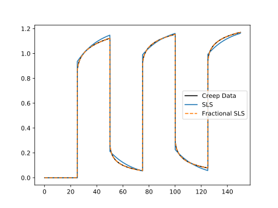

# Predicting Responses

## Stress/Strain/Time Data
Now that we know how to import datasets and fit models to them, let's try and make some predictions based on fitted model parameters. We will use our `data` imported and models `fitted_SLS_model` and `fitted_fractSLS_model` as fitted in the previous section. First we'll use model prediction to see how well the models were fitted to the relaxation data.
```
SLS_predicted = modelpredict(data, fitted_SLS_model, :G)

fractSLS_predicted = modelpredict(data, fitted_fractSLS_model, :G)
```
Now we have the predicted data, we can plot. Any plotting library can be used but the example code below uses the [PyPlot Julia package](https://github.com/JuliaPy/PyPlot.jl).
```
using PyPlot

fig, ax = subplots()
ax[:plot](data.t, data.σ, label="Data", color="black")
ax[:plot](SLS_predicted.t, SLS_predicted.σ, label="SLS")
ax[:plot](fractSLS_predicted.t, fractSLS_predicted.σ, "--", label="Fractional SLS")
ax[:legend](loc="best")
show()
```
 

We can see from the above plot that the fractional Standard Linear Solid model has yielded a much better fit than that regular Standard Linear Solid. Now we also have creep data generated using the same model. Let's see how well our fitted models perform making predictions on a completely different type of data.
```
creep_data = importdata(["stress", "strain", "time"], "DataCreep.csv")

creep_SLS_predicted = modelpredict(creep_data, fitted_SLS_model, :J)

creep_fractSLS_predicted = modelpredict(creep_data, fitted_fractSLS_model, :J)
```
Note the two differences in the [`modelpredict`](@ref) function calls. In the first argument we are predicting based on the creep data so we use the creep data we imported in the first line of the above code block. In the third argument we use the argument `:J` instead of `:G` to make predictions based on the creep modulus, not the relaxation modulus as before. Plotting the above but strain this time not stress as it's using the creep modulus:
```
fig, ax = subplots()
ax[:plot](creep_data.t, creep_data.ϵ, label="Creep Data", color="black")
ax[:plot](creep_SLS_predicted.t, creep_SLS_predicted.ϵ, label="SLS")
ax[:plot](creep_fractSLS_predicted.t, creep_fractSLS_predicted.ϵ, "--", label="Fractional SLS")
ax[:legend](loc="best")
show()
```



Again we see that the fractional SLS model has yielded a far better prediction, even on data not seen during the fitting stage.

## Frequency Data
Although it is very similar to the above, for completeness this section demonstrates how to predict frequency-based rheology data.
```
frequency_data = importdata(["Gp", "Gpp", "frequency"], "FrequencyData.csv")

freq_fractSLS_predicted = dynamicmodelpredict(frequency_data, fitted_fractSLS_model)
```
See the [`dynamicmodelpredict`](@ref) for more information on the function itself.