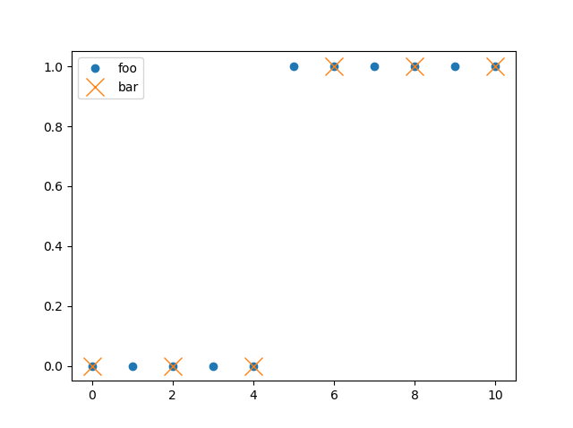
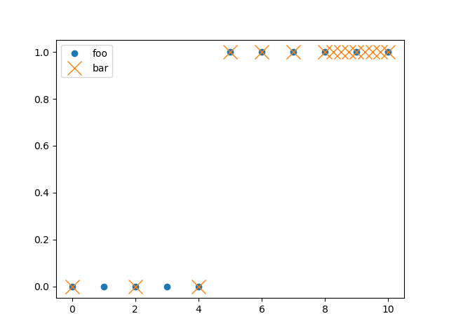
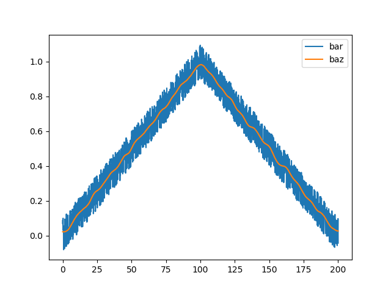

# Sampling and Filtering

RHEOS offers several functions for sampling and filtering; this page is intended to be a brief tutorial of their use. For detailed descriptions of functions and their optional arguments, see the [API](@ref) section. This section uses some of the data generation functions discussed in more detail in the [Generating Data](@ref) section.

## Downsampling
To simply downsample data by taking every nth sample, the [`downsample`](@ref) function can be used. In the below example, every 2nd element is taken.
```
foo = stepgen(10, 5)

bar = downsample(foo, [0.0, 10.0], [2])
```


More than 1 section of downsampling can be defined. For example, the below code takes every 2nd element from time=0.0 seconds to time=5.0 seconds and after that it takes every element. Note that as there are now two different sample rates, the data set is considered as having 'variable' sampling by RHEOS which adds a computational cost to fitting operations.
```
foo = stepgen(10, 5)

bar = downsample(foo, [0.0, 5.0, 10.0], [2, 1])
```


## Upsampling and Downsampling
The [`fixedresample`](@ref) is similar to the [`downsample`](@ref) function but also allows for upsampling. The syntax is almost the same but it requires an addition argument to tell RHEOS whether it should upsample or downsample for that section. Below is an example with three distinct sampling regions, the first two regions are downsampled and the third region is upsampled.
```
foo = stepgen(10, 5)

bar = fixedresample(foo, [0.0, 5.0, 8.0, 10.0], [2, 1, 4], ["down", "down", "up"])
```


## Variable Resampling
Although still in a somewhat experimental stage, RHEOS has a variable resampling function, [`variableresample`](@ref) which attempts to focus the sampled points on regions of rapid change in the 0th, 1st and 2nd derivatives of the data. This may be useful for focusing on the model fits in the most dynamic regions of the data. See below for a minimal example of use and plotted outcome. See the [API](@ref) for more detailed look at function arguments.
```
foo = singen(2, 0.5; stepsize=0.01)

bar = variableresample(foo, :σ, 0.5)
```


## Smoothing
Lastly, RHEOS provides a smoothing function, [`smooth`](@ref). The first argument is the data to smooth and the second argument is the (very) approximate time scale of smoothing. (It uses Gaussian smoothing and can be thought of as a low pass filter for information occuring on time scales shorter than the 2nd argument). The padding can be changed using a keyword argument if desired, see [API](@ref) and [ImageFiltering.jl Documentation](https://juliaimages.github.io/ImageFiltering.jl/stable/function_reference.html) for more details. The example below smooths out some noisy data.
```
foo = rampgen(200.0, 0.0, 100.0; stepsize = 0.1) - rampgen(200.0, 100.0, 200.0; stepsize = 0.1)

bar = foo + 0.1*noisegen(200.0; stepsize=0.1)

baz = smooth(bar, 10.0)
```
